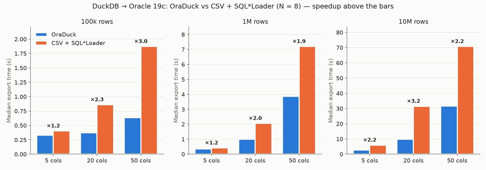
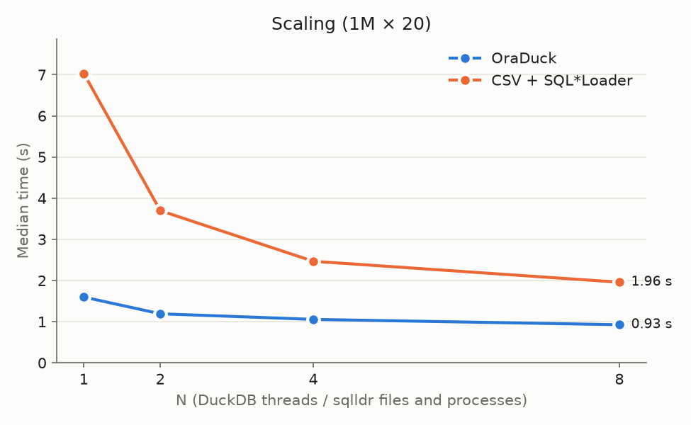
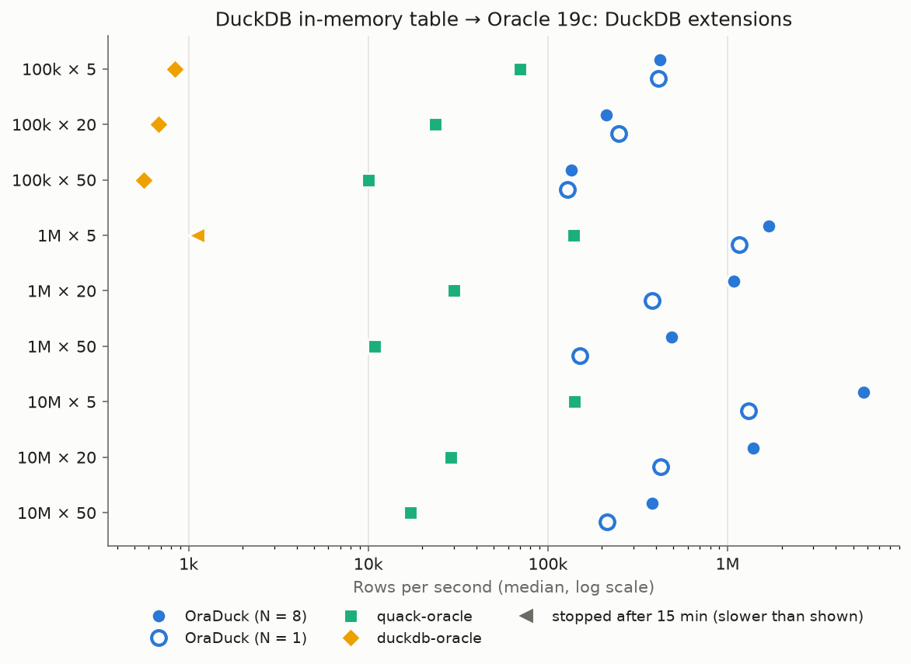

# OraDuck benchmark: DuckDB → Oracle 19c

Only the export is timed: from the loaded DuckDB table to the rows committed in Oracle. SQL*Loader = CSV export (N files) + N concurrent sqlldr processes. Median of 5 runs, after one warm-up run, methods interleaved.

## Environment

- DuckDB v1.5.5, OCI client 19.32.0.0.0, Oracle 19.3.0.0.0
- Oracle 19c 19.3.0.0 (free registry image). The intended target, 19c 19.30 (Release Update), could not be tested: its images and patches require an Oracle support contract.
- SQL*Loader: Release 19.0.0.0.0 / Version 19.32.0.0.0 — parameters `multithreading=true direct=true parallel=true bindsize=134217728 readsize=134217728 streamsize=1000000 columnarrayrows=1000`
- CPU 13th Gen Intel(R) Core(TM) i5-1340P; client on CPUs [0, 1, 2, 3, 4, 5, 6, 7], Oracle on CPUs 8-15
- fakelake 1.7.2; available memory 8.2 GB

## Matrix (N = 8)

| Rows | Columns | CSV volume (MB) | OraDuck (s) | SQL*Loader total (s) | of which CSV (s) | of which sqlldr (s) | Speedup | OraDuck (rows/s) | OraDuck (MB/s) | SQL*Loader (MB/s) | OraDuck min–max (s) | SQL*Loader min–max (s) |
|---|---|---|---|---|---|---|---|---|---|---|---|---|
| 100k | 5 | 6.8 | 0.332 | 0.404 | 0.041 | 0.363 | ×1.2 | 301,205 | 20.4 | 16.8 | 0.283–0.341 | 0.373–0.448 |
| 100k | 20 | 26.5 | 0.374 | 0.860 | 0.147 | 0.714 | ×2.3 | 267,380 | 70.8 | 30.8 | 0.258–0.450 | 0.750–1.011 |
| 100k | 50 | 63.9 | 0.633 | 1.872 | 0.352 | 1.469 | ×3.0 | 157,978 | 100.9 | 34.1 | 0.610–0.663 | 1.747–1.887 |
| 1M | 5 | 67.7 | 0.354 | 0.416 | 0.076 | 0.340 | ×1.2 | 2,824,859 | 191.2 | 162.6 | 0.345–0.381 | 0.389–0.428 |
| 1M | 20 | 264.8 | 1.007 | 2.061 | 0.379 | 1.657 | ×2.0 | 993,049 | 262.9 | 128.5 | 0.614–1.303 | 1.918–2.639 |
| 1M | 50 | 638.9 | 3.867 | 7.198 | 1.656 | 5.471 | ×1.9 | 258,598 | 165.2 | 88.8 | 1.960–6.568 | 7.116–8.098 |
| 10M | 5 | 676.8 | 2.775 | 5.985 | 1.509 | 4.476 | ×2.2 | 3,603,604 | 243.9 | 113.1 | 2.192–4.107 | 5.503–6.925 |
| 10M | 20 | 2647.9 | 9.819 | 31.495 | 11.496 | 19.999 | ×3.2 | 1,018,434 | 269.7 | 84.1 | 7.658–11.157 | 25.352–38.620 |
| 10M | 50 | 6389.1 | 31.654 | 70.749 | 25.350 | 46.198 | ×2.2 | 315,916 | 201.8 | 90.3 | 27.681–37.632 | 62.030–88.855 |

## Analysis

<!-- Hand-written from the 2026-09-24 campaign: rewrite it after any new measurement campaign. -->
- **OraDuck is faster in all 9 cases**, by ×1.2 to ×3.2 (medians). On the largest case (10M × 50,
  6.4 GB of CSV) it loads in 31.7 s versus 70.7 s, about 200 MB/s of CSV equivalent versus 90 MB/s.
- **Row width**: for small tables the speedup grows with the number of columns (100k rows: ×1.2 with
  5 columns, ×3.0 with 50). Formatting and parsing CSV costs more as rows get wider, whereas OraDuck
  passes values in native or Oracle internal formats.
- **100k rows**: the table fits in a single DuckDB row group (122,880 rows), so there is only one
  thread, one OraDuck session and one CSV file for sqlldr: no parallelism at all. OraDuck is then
  dominated by a fixed cost of about 0.3 s (connection, prepare, commit), which is why 100k and 1M rows
  with 5 columns take about the same time.
- **CSV share**: writing the CSV files accounts for 10 % (100k × 5) to 36 % (10M × 20 and 10M × 50) of
  the SQL\*Loader time. Even against the sqlldr phase alone, OraDuck is faster in 8 cases out of 9;
  the exception is 1M × 5 (0.354 s vs 0.340 s).
- **Scaling** (1M × 20): OraDuck goes from 1.60 s to 0.93 s between N = 1 and N = 8, flattening from
  N = 4 (Oracle on 8 E-cores, synchronous commits, `log file sync`). SQL\*Loader gains more from
  parallelism (7.0 s to 2.0 s) because it parses the CSV on the client side, so the speedup drops from
  ×4.4 to ×2.1.
- **Spread**: it remains large on the big cases, e.g. OraDuck from 2.0 s to 6.6 s on 1M × 50. Client and
  server share a 15 GB laptop under memory pressure (zram swap), despite the cpusets, the locked SGA
  and copy-on-write-free storage. Medians of 5 runs are reported, with the min–max range.
- **Asymmetric tuning**: only OraDuck's `STREAM_SIZE` was tuned (on 1M × 20). SQL\*Loader runs with the
  parameters mandated by the reference method, untuned.
- **Limits**: Oracle 19.3 instead of 19.30, NOARCHIVELOG database, client and server on the same
  machine, a single set of column types (see `bench/oraduck_bench/schema.py`), timestamps without
  fractional seconds (Fakelake writes epoch seconds).

## Scaling

| N | OraDuck (s) | SQL*Loader (s) | Speedup |
|---|---|---|---|
| 1 | 1.598 | 7.033 | ×4.4 |
| 2 | 1.192 | 3.697 | ×3.1 |
| 4 | 1.056 | 2.467 | ×2.3 |
| 8 | 0.926 | 1.959 | ×2.1 |

## Comparison with other DuckDB → Oracle extensions

Source: a DuckDB in-memory table, copied from the benchmark database before the timer starts (the 10M × 50 case, about 9 GB, reads the attached database file instead). Timed: the single statement that writes to Oracle, `COPY … TO` for OraDuck and `INSERT INTO <attached table> SELECT * FROM source` for the others. Median of 3 runs after one warm-up run, methods interleaved, checksums checked after every run. A run is stopped after 15 min (whole DuckDB process); a method stopped on a case is not run on the cases with at least as many rows and columns ("not run").

- [quack-oracle](https://github.com/krokozyab/quack-oracle): community extension `oracle_scanner` 0.2.2, pure C++ implementation of the Oracle wire protocol; one session, array inserts of up to 1,024 rows per round trip.
- [duckdb-oracle](https://github.com/rinie/duckdb-oracle) (rinie): commit 20d4389, built from source against DuckDB v1.5.5 (one missing `#include` added to build with GCC 16); ODPI-C, one session, one `INSERT … VALUES` per row.
- OraDuck: OCI direct path, one session per DuckDB thread (N = 8, and N = 1 for a single-session comparison).
- All three load identical data (same checksums, `MINUS` = 0 between the tables). One difference: OraDuck refuses DECIMAL into BINARY_DOUBLE (and other conversions outside its type table), the other two let Oracle convert.

| Rows | Columns | OraDuck N=8 (s) | OraDuck N=1 (s) | quack-oracle (s) | duckdb-oracle (s) | OraDuck speedup vs quack-oracle | OraDuck speedup vs duckdb-oracle |
|---|---|---|---|---|---|---|---|
| 100k | 5 | 0.237 | 0.242 | 1.428 | 119.407 | ×6.0 | ×504 |
| 100k | 20 | 0.473 | 0.405 | 4.223 | 146.222 | ×8.9 | ×309 |
| 100k | 50 | 0.739 | 0.781 | 9.998 | 177.661 | ×14 | ×240 |
| 1M | 5 | 0.592 | 0.864 | 7.172 | > 15 min | ×12 | > ×1520 |
| 1M | 20 | 0.927 | 2.627 | 33.169 | not run | ×36 | — |
| 1M | 50 | 2.043 | 6.659 | 92.298 | not run | ×45 | — |
| 10M | 5 | 1.746 | 7.607 | 71.018 | not run | ×41 | — |
| 10M | 20 | 7.177 | 23.640 | 345.247 | not run | ×48 | — |
| 10M | 50 | 26.172 | 46.776 | 583.793 | not run | ×22 | — |

With a single session (N = 1), OraDuck is 5.9 to 15 times faster than quack-oracle.

## STREAM_SIZE tuning (OraDuck, 1M × 20, N = 8)

| STREAM_SIZE | Time (s) |
|---|---|
| 64 KiB | 0.677 |
| 128 KiB | 1.145 |
| 256 KiB | 1.133 |
| 512 KiB | 1.160 |
| 1024 KiB | 1.054 |
| 4096 KiB | 0.616 |
| 16384 KiB | 0.664 |

Sizes were measured one after the other, not interleaved: the shape of the curve mostly reflects the machine's drift during the campaign. 4 MiB is kept (best median, small spread between runs, consistent with the single-session probe, E4). The SQL*Loader parameters are the ones mandated by the reference method and were not tuned.

